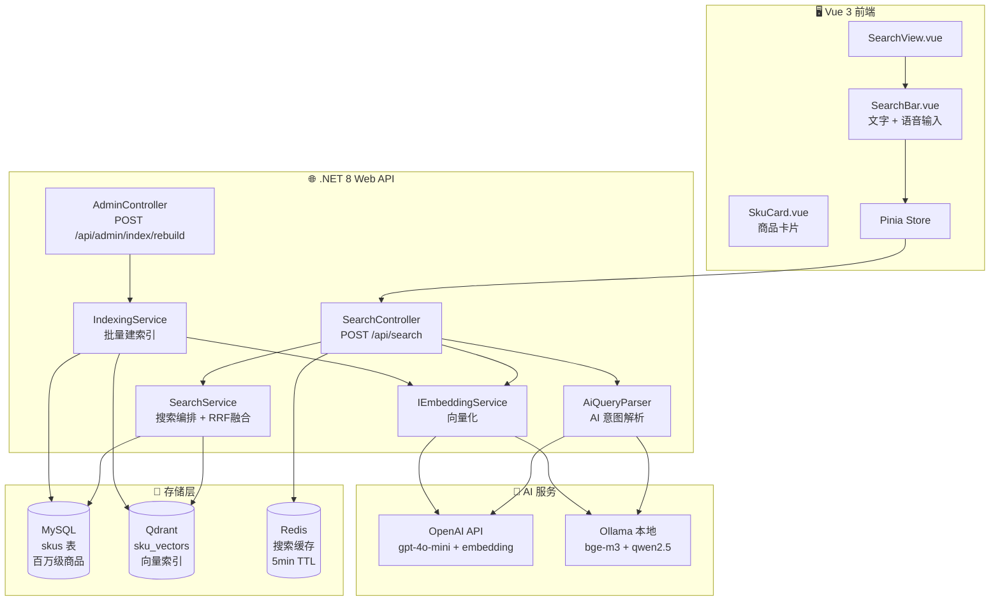
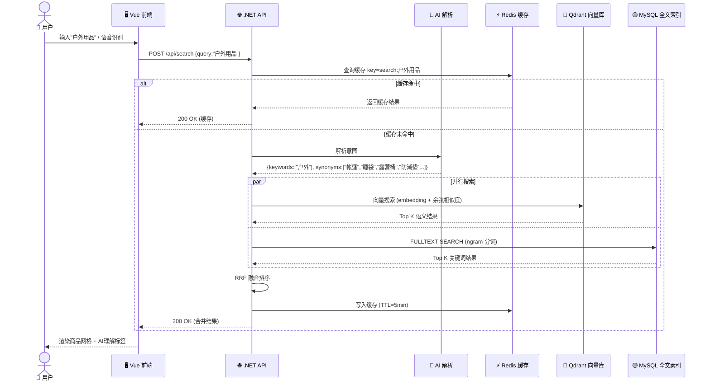
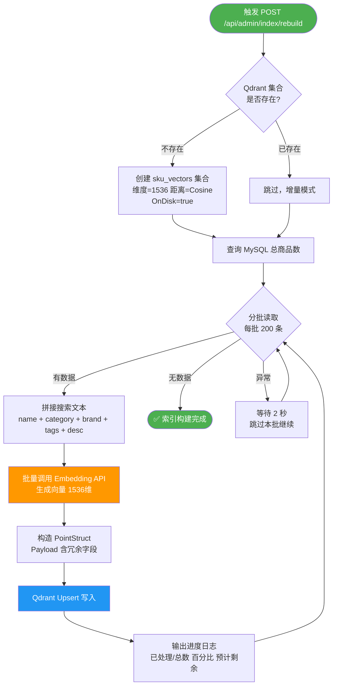
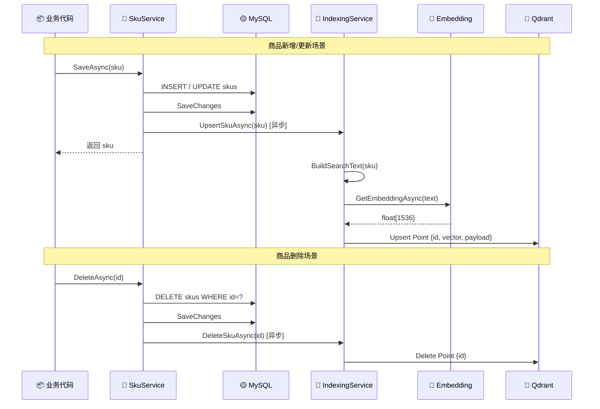
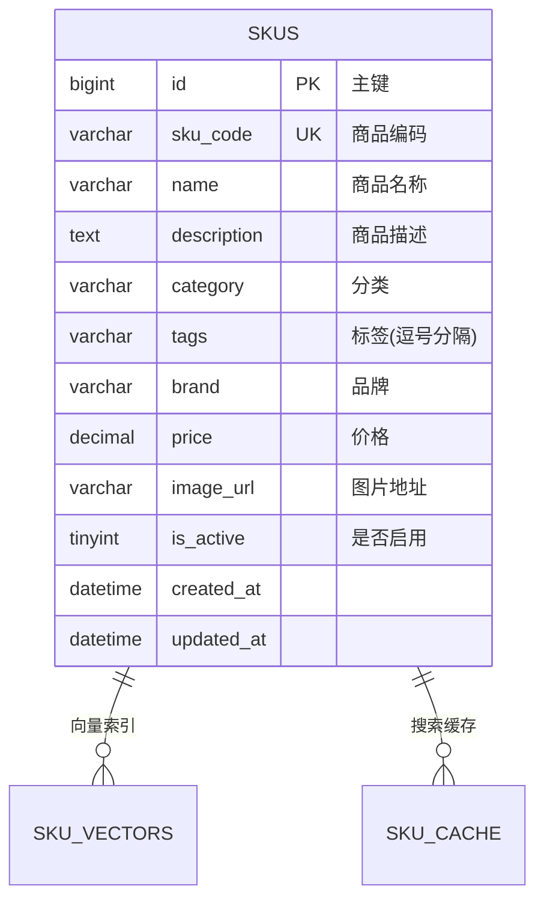
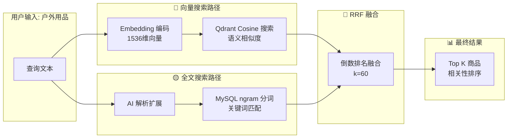
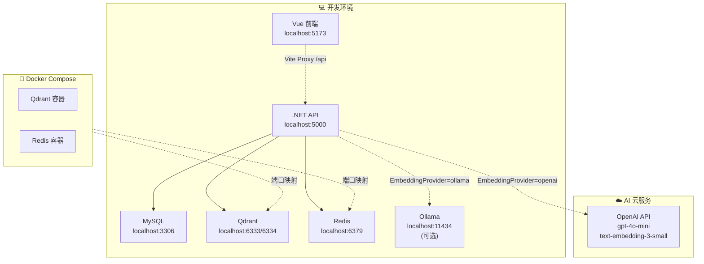
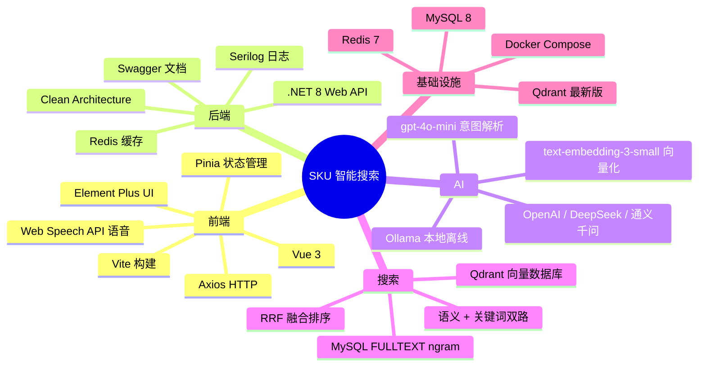

# 项目架构与流程图

> 所有图表使用 Mermaid 语法，GitHub / VSCode 原生渲染

---

## 1. 系统架构图

---

## 2. 搜索流程图

---

## 3. 全量建索引流程图

---

## 4. 增量同步流程图

---

## 5. 数据库表结构

---

## 6. 向量搜索 vs 全文搜索对比

---

## 7. 部署架构

---

## 8. 技术栈总览

